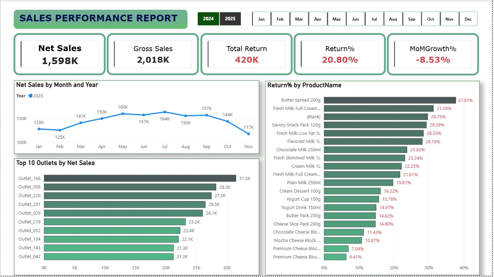
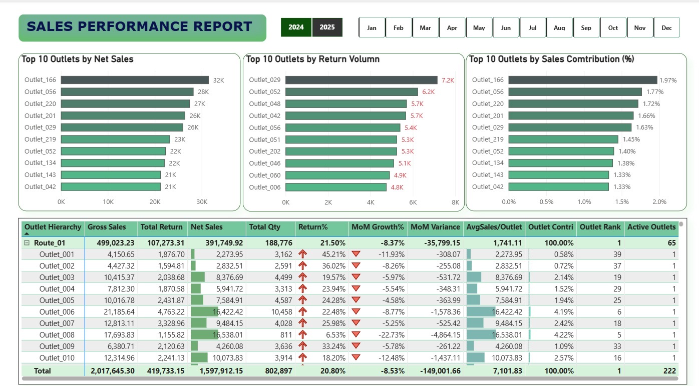
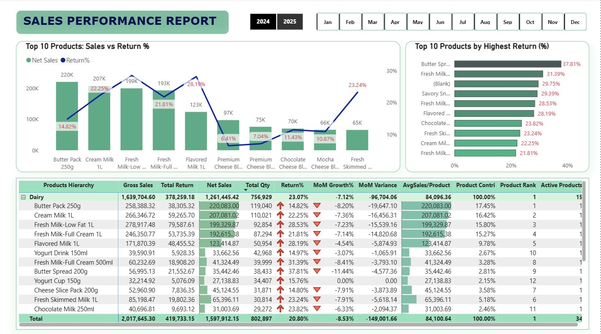
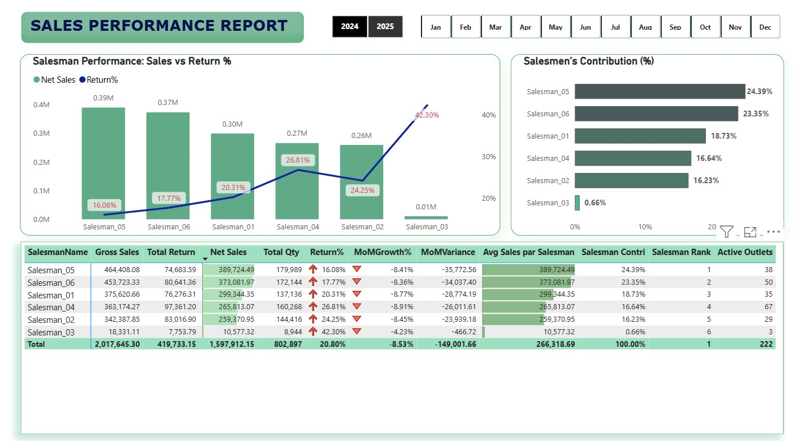

# Sales Performance Analysis Dashboard (F&B Business Case)

This project is based on a real-world sales and operations scenario in an FMCG/F&B distribution business.

The business distributes products across 1,000+ supermarket outlets using van sales operations. 
However, challenges exist in tracking performance, managing product returns, and optimizing route efficiency.

## Key Business Questions

- How is overall sales performance trending over time?
- Which outlets and products are driving growth vs losses?
- What is the impact of product returns on net sales?
- Which areas require immediate business attention?
  
## Dashboard Structure & Analysis

### Executive Overview
Provides a high-level summary of overall business performance, including net sales, gross sales, total returns, return rate, and MoM growth.  
This section helps stakeholders quickly assess whether the business is improving or declining.

Key Insight: Despite strong gross sales, high return rates are impacting net performance and overall growth.
Key dashboard view:

### Outlet Analysis
Analyzes performance across different outlets to identify top-performing and underperforming locations.  
Focus areas include:
- Net sales contribution by outlet  
- Return volume by outlet  
- Sales distribution efficiency  

This helps identify operational issues and opportunities at the outlet level.

Key Insight: Several high-revenue outlets also show high return rates, indicating inefficiencies in distribution or demand mismatch.

Key dashboard view:

### Product Analysis
Evaluates product-level performance to understand which products drive revenue and which contribute to losses.  
Focus areas include:
- Top-selling products  
- High return rate products  
- Product contribution to total sales  

This helps optimize product mix and reduce inefficiencies.

Key Insight: Some products generate high sales volume but also experience high return rates, reducing their overall contribution to net sales. Meanwhile, certain low-performing products remain widely distributed, indicating potential inefficiencies in product portfolio management.

Key dashboard view:

### Salesman Analysis
Examines individual salesman performance to identify productivity gaps and operational inconsistencies.  
Focus areas include:
- Net sales vs return rate by salesman  
- Contribution to overall sales  
- Performance variation across sales team  

This supports better incentive alignment and performance management.

Key Insight: Sales performance varies significantly across salesmen, with some achieving high sales but also high return rates. This suggests a need to align incentives with net sales performance and improve accountability for product returns.

Key dashboard view:

## Data Understanding

The dataset includes:

- Sales transactions (invoice-level)
- Product data
- Outlet/customer data
- Salesman and route data

Key metrics:

- Gross Sales
- Total Returns
- Net Sales (Sales – Returns)
- Return %
- Month-over-Month Growth

## Analysis Approach

- Data cleaning and transformation using Power Query
- Star schema data modeling in Power BI
- Defined Net Sales as Sales minus Returns
- Performed MoM trend analysis
- Segmented performance by outlet, product, and salesman

## Key Insights

- High sales volume does not always translate to strong performance due to high returns
- Some outlets generate high revenue but also high return percentages
- Certain products consistently underperform despite wide distribution
- Performance varies across routes, indicating inefficiencies

## Business Recommendations

- Re-evaluate distribution strategy for high-return outlets
- Optimize route planning
- Reduce or review low-performing products
- Align incentives with net sales instead of gross sales

## Tools Used

- Power BI
- Power Query
- DAX
- Excel
